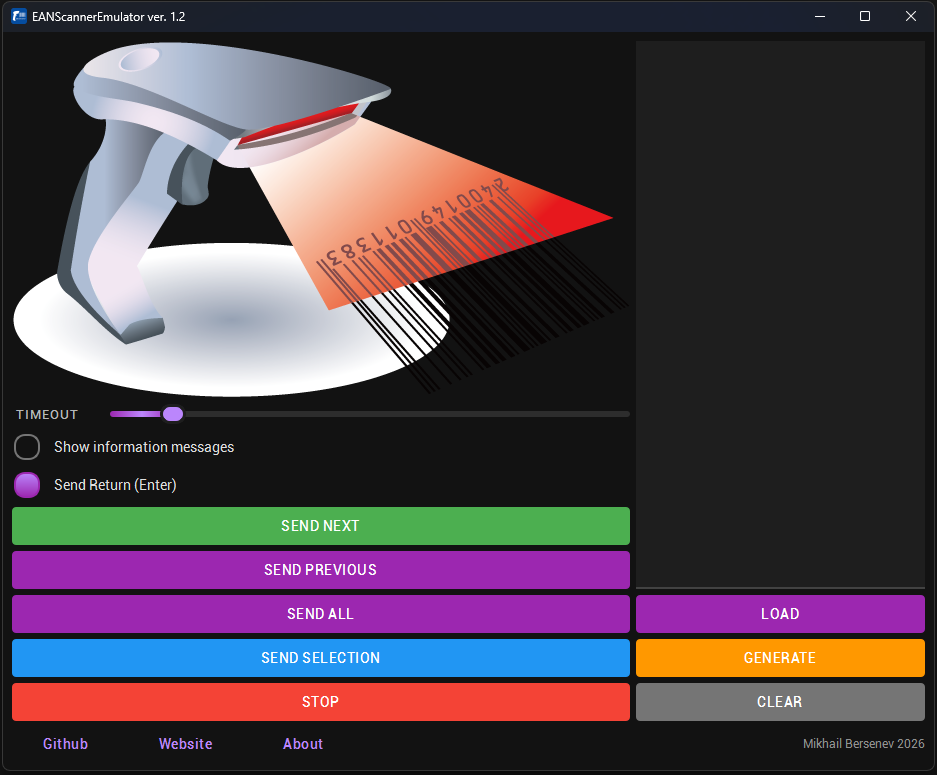

# EANScannerEmu

**A cross-platform barcode scanner emulator for testing and automation**

## Overview

EANScannerEmu is a powerful application that emulates a barcode scanner, allowing you to automatically input barcode data into any application as if you were using a physical scanner. Perfect for testing, development, training, and automation.

## Features

- **Barcode Scanner Emulation**: Simulates a physical scanner by sending keystrokes
- **Multiple Format Support**: 
  - EAN-8
  - EAN-13
  - DataMatrix (Honest Sign / Честный знак)
- **Batch Processing**: Send multiple barcodes sequentially with configurable delays
- **Automatic Save/Load**: Barcodes are saved to `barcodes.txt` and loaded on startup
- **Flexible Sending**: Send next, previous, or all barcodes automatically
- **Cross-Platform**: Works on Linux (X11/Wayland) and Windows

## Quick Start

1. **Enter Barcodes**: Type or paste barcodes into the text field (one per line)
2. **Load**: Click "Read" to load barcodes and save to file
3. **Send**: Use "Send Next", "Send Previous", or "Send All" to input barcodes
4. **Generate**: Click "Generate" to create random barcodes of selected type

## Usage Tips

- **Timeout Slider**: Adjust delay between barcode sends (0-60 seconds)
- **Send Return**: Enable automatic Enter key after each barcode
- **Auto-Load**: Barcodes from `barcodes.txt` are automatically loaded on startup
- **Clean**: Clears all barcodes and deletes the save file

## Supported Formats

| Format | Description | Length |
|--------|-------------|--------|
| EAN-8 | European Article Number 8 | 8 digits |
| EAN-13 | European Article Number 13 | 13 digits |

## Platform Support

- **Linux X11 (X.org Server)**: Full support
- **Linux Wayland**: Requires `ydotool` for keyboard emulation
- **Windows**: Native support via Windows API

## License

This project is licensed under the GNU General Public License v3.0 - see the [LICENSE](LICENSE) file for details.

---

**Note**: This tool is intended for legitimate testing and development purposes only.
