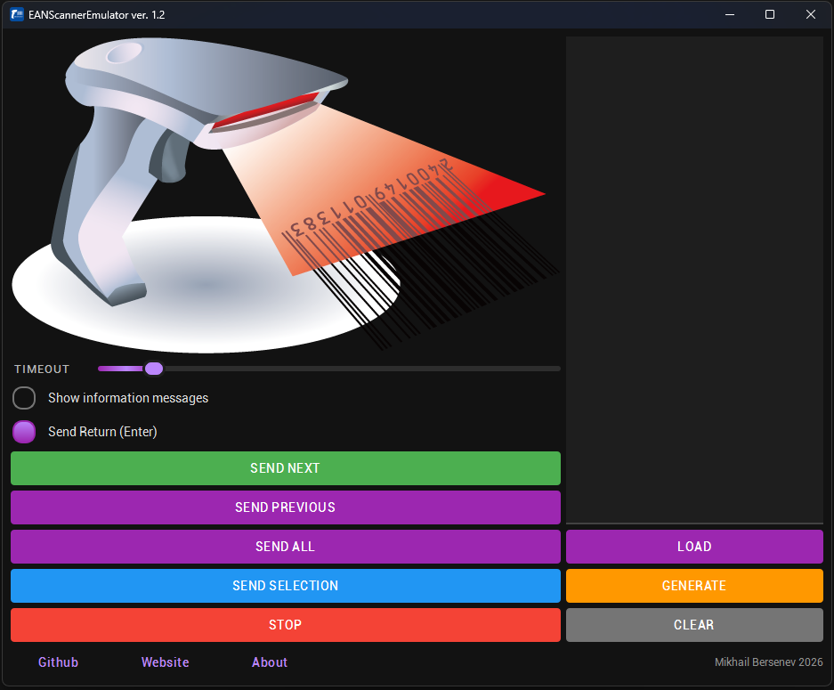

# EANScannerEmu

<div align="center">

**A cross-platform barcode scanner emulator for testing and automation**

[](https://www.gnu.org/licenses/gpl-3.0)
[](https://www.qt.io/)

</div>

## Overview

EANScannerEmu is a powerful application that emulates a barcode scanner, allowing you to automatically input barcode data into any application as if you were using a physical scanner. Perfect for testing, development, training, and automation.



## Features

- **Barcode Scanner Emulation**: Simulates a physical scanner by sending keystrokes
- **Multiple Format Support**: 
  - EAN-8
  - EAN-13
  - UPC-A
  - UPC-B
  - UPC-C
  - UPC-D
  - UPC-E
  - UPC-2
  - UPC-5
  - GS1 DataMatrix
  
- **Batch Processing**: Send multiple barcodes sequentially with configurable delays
- **Automatic Save/Load**: Barcodes are saved to `barcodes.txt` and loaded on startup
- **Flexible Sending**: Send next, previous, all barcodes, or **only the text you highlighted** (Send Selection)
- **Cross-Platform**: Works on Linux (X11/Wayland) and Windows

## Quick Start

1. **Enter Barcodes**: Type or paste barcodes into the text field (one per line)
2. **Load**: Click "Load" to load barcodes and save to file
3. **Send**: Use "Send Next", "Send Previous", or "Send All" to input barcodes; or **"Send Selection"** to type whatever you highlighted in the text field (see below)
4. **Generate**: Click "Generate" to create random barcodes of selected type


## Usage Tips

- **Timeout Slider**: Adjust delay between barcode sends (0-60 seconds)
- **Send Return**: Enable automatic Enter key after each barcode
- **Send Selection**: In the barcode text field, **select (highlight) the characters** you want to inject, then click **"Send Selection"**. The app sends that string as keystrokes (and **Enter** after it if **Send Return** is checked). You do **not** need to press **Load** first—only a non-empty selection matters. If your selection spans **multiple lines**, only the **first non-empty line** is sent (leading/trailing spaces on that line are trimmed). Sending runs after the **Timeout** delay, same as batch sends—use it to switch focus to the target window.
- **Auto-Load**: Barcodes from `barcodes.txt` are automatically loaded on startup
- **Clean**: Clears all barcodes and deletes the save file

## Data File Location

The app reads/writes the barcode list in the user's **home directory** as `barcodes.txt`.

Typical locations:

- **Linux**: `~/barcodes.txt`
- **Windows**: `C:\Users\<YourUser>\barcodes.txt`
- **macOS**: `/Users/<YourUser>/barcodes.txt`

## Supported Formats

### Sending (emulation)

The app sends text as keyboard input. In practice, you can send:

- Any barcode string you paste/type into the list
- Any highlighted text via **Send Selection**

No strict barcode validation is enforced at send time.

### Built-in generator

| Format | Description | Generated length |
|--------|-------------|------------------|
| EAN-8 | European Article Number 8 | 8 digits |
| EAN-13 | European Article Number 13 | 13 digits |

## Platform Support

- **Linux X11 (X.org Server)**: Full support
- **Linux Wayland**: Requires `ydotool` for keyboard emulation
- **Windows**: Native support via Windows API
- **macOS**: Native support via Quartz Event Services (ApplicationServices, Carbon). For sending keystrokes to other apps, grant **Input Monitoring** (or **Accessibility**) permission in **System Settings → Privacy & Security** when prompted.

### Wayland Notes

On Wayland, install `ydotool` and ensure its daemon is running (distribution-specific service name). If `ydotool` is not available, sending barcodes will fail.

## Building

See **[BUILD.md](BUILD.md)** for prerequisites and step-by-step instructions (qmake on Linux, Windows, macOS, and **AppImage** for Linux x86_64).

**AppImage (quick):** from the repository root,

```bash
export QMAKE=/usr/bin/qmake6
./packaging/linux/build-appimage.sh
```

## License

This project is licensed under the GNU General Public License v3.0 - see the [LICENSE](LICENSE) file for details.

---

**Note**: This tool is intended for legitimate testing and development purposes only.

## Troubleshooting (Quick)

- **Nothing is typed into the target app**: Focus the target window before pressing send (after the **Timeout** delay if you use **Send Selection** or batch send).
- **Send Selection does nothing / warning about selection**: Highlight at least one non-whitespace character in the barcode field; empty or whitespace-only selection is rejected.
- **Wayland send does not work**: Verify `ydotool` is installed and the daemon is active.
- **No auto-loaded barcodes on startup**: Check whether `barcodes.txt` exists in your home directory.
